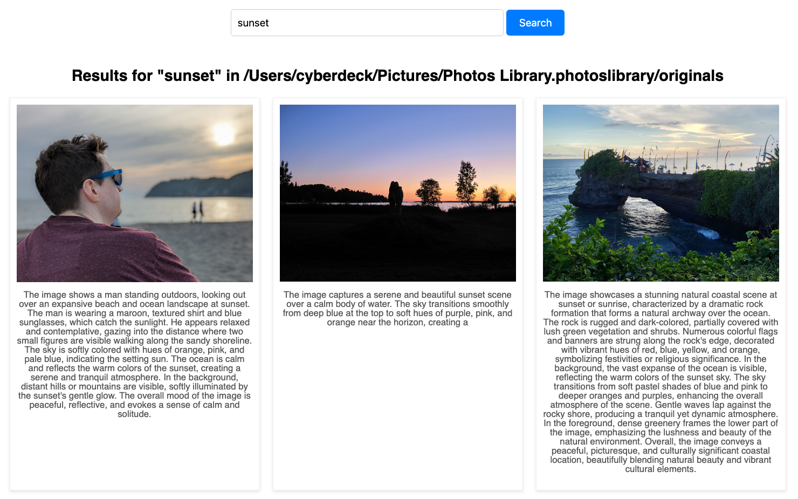

# Image Indexer

This Ruby script provides a command-line tool to caption images in a specified directory using a local Moondream API, and enable searching through these captions. It uses SQLite for database storage and FTS5 for efficient full-text search.

## How to Use

First, install and run [Moondream Station](https://docs.moondream.ai/station) (or otherwise host the API locally).

### Indexing Images

To index images in a directory, run the script with the `index` command followed by the path to the directory containing your images.

```bash
bundle exec ruby image_indexer.rb --index --directory /path/to/your/images
```

This will use the local Moondream API to provide the captions, and they will be saved to a file called `.image-indexer.db` in the target directory.

### Searching Captions

To search through the indexed captions, use the `search` command followed by your search query.

```bash
bundle exec ruby image_indexer.rb --search --directory /path/to/your/images "your search query"
```

Or run the included web server:

```bash
bundle exec ruby app.rb /path/to/your/images
```

Browse to http://localhost:4567 to search and view images:



## Ideas

* use other Moondream capabilities like query "list of objects, comma-delimited" to get additional semi-structured data about the scene
* Moondream 3 when it hits Mac, or maybe other better vision models?
* better text matching than out of box FTS5 (stemming, etc.)
